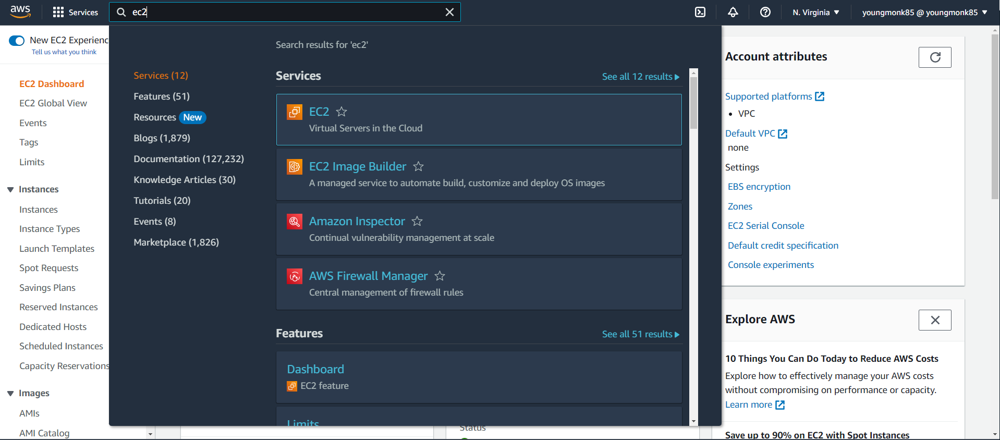
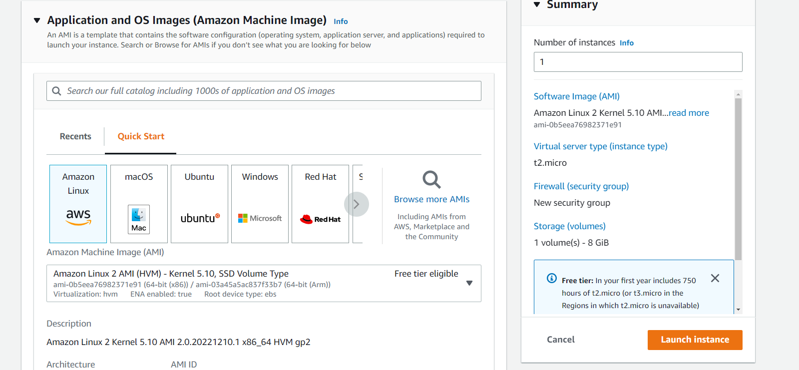
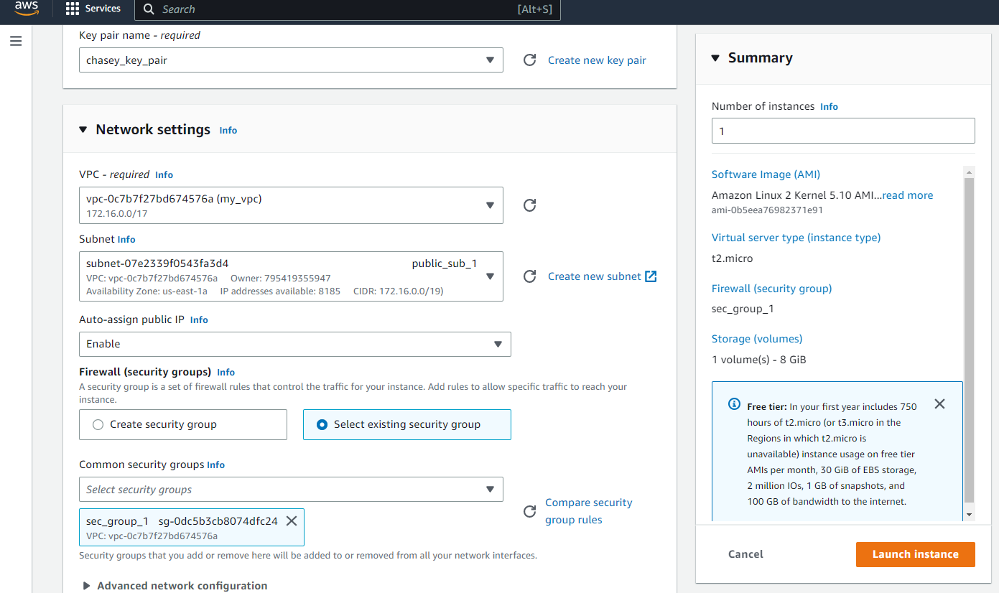
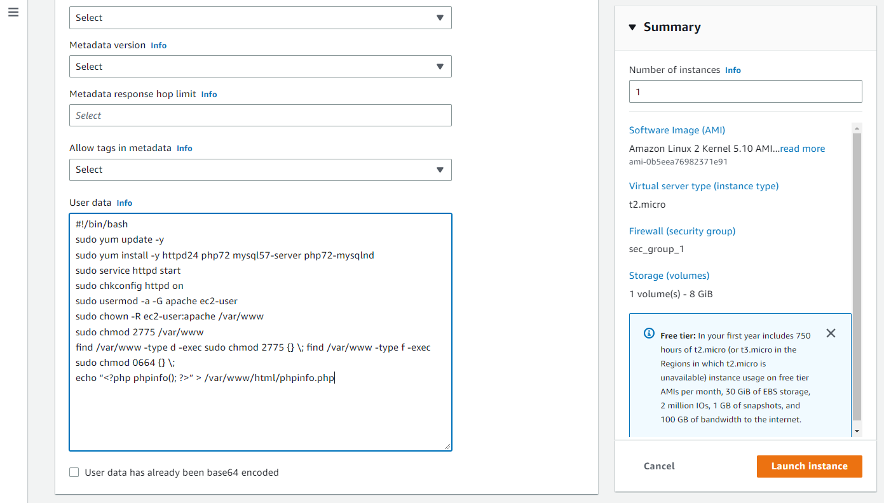
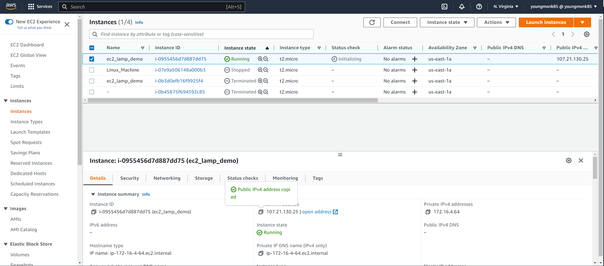
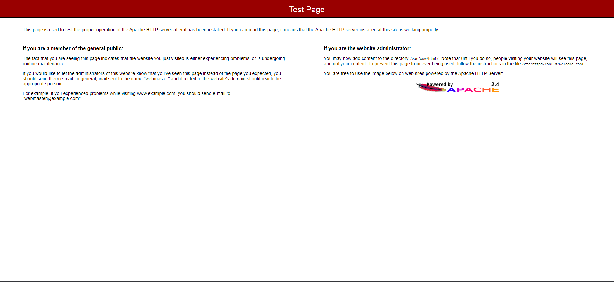
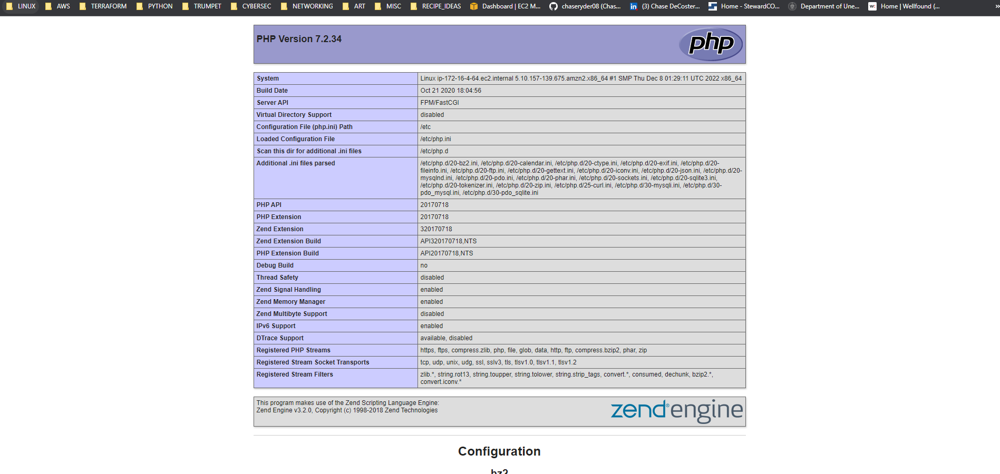
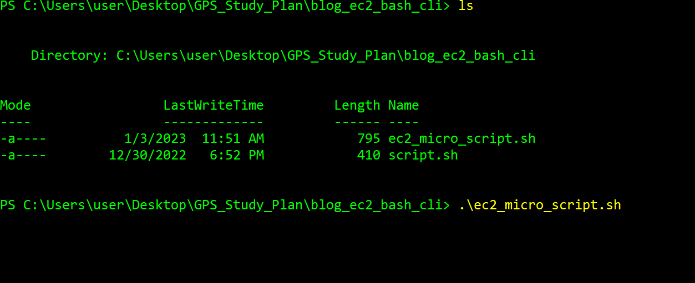
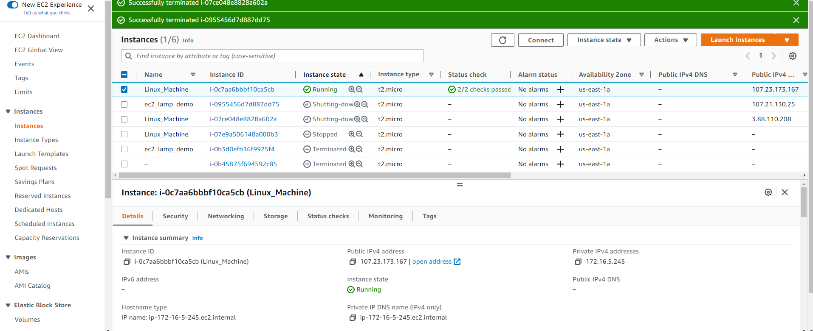
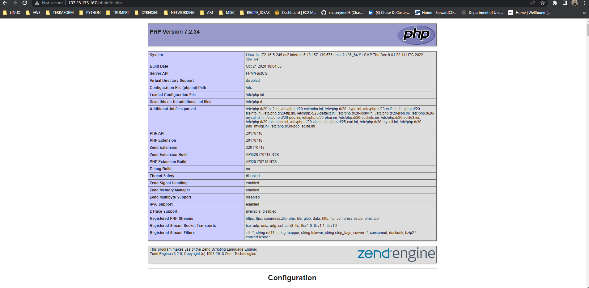

    

        <h1>LAMP Stack Setup on EC2 Instance - January, 02, 2023</h1>
        

        
For this project, I first manually created my instance in the AWS console, then proceeded to use the AWS CLI to also launch the same instance with the LAMP stack. I will be explaining both processess: 
         
        
        
First I created a Linux EC2 instance in the AWS console. I chose the free tier EC2 micro instance. 

        
        
Next, I made sure to use my keypair ('chasey_key_pair') which will allow me to gain secure access when SSH into the machine.

        
I also then made sure I selected my VPC, and chose my public subnet which will allow me to gain access. I also made sure I enabled auto-assign public IP, and used my security group which permits SSH, HTTP, HTTPD access (ports 22, 80, and 443). Storage settings I set to default.

        
In order for the EC2 instance to install the necessary components for the LAMP stack, I then put in the bash script (see below) in the user data section, which is located in Advanced details.

        
        
<code> #!/bin/bash 
        yum update -y 
        amazon-linux-extras install -y lamp-mariadb10.2-php7.2 php7.2 
        yum install -y httpd mariadb-server 
        systemctl start httpd 
        systemctl enable httpd 
        usermod -a -G apache ec2-user 
        chown -R ec2-user:apache /var/www 
        chmod 2775 /var/www 
        find /var/www -type d -exec chmod 2775 {} \; 
        find /var/www -type f -exec chmod 0664 {} \; 
        echo "<?php phpinfo(); ?>" > /var/www/html/phpinfo.php 
        
</code>

          
         
         
I then select "Launch instance", and wait a a few minutes for the instance to be launched as it must run the bash script to install necessary software*. To confirm the EC2 instance is up and running with the necessary LAMP stack, I then copy the Public IP address into my browser and it will display the test page for Apache page as shown below.

         
         
Add /phpinfo.php to the end of your URL, you should see that PHP is up and running as well. (It is best to delete this file later if you need to use this server for production as it contains sensitive information).

         
         
And that's it! A full LAMP EC2 instance is now up and running and ready.

         <h1>LAMP Stack Setup on EC2 Instance using AWS-CLI : Part 2 - January, 03, 2023</h1>
        

        
Next, I did the same thing using the AWS CLI. First I had to make sure I installed and set up the configuration to run AWS CLI on my local computer. -- Since I am on Windows, I used Powershell with administrative privileges;

        

These commands can be written individually in AWS CLI, but to simplify and automate the process, I created a bash script that can be run by itself.

        
At the bottom of the script, I added a bashscript in the '--user-data' field, which held all the individual commands to install the LAMP stack. (same as above)

        

<code>
          aws ec2 run-instances \ 
    --image-id ami-0b5eea76982371e91 \  
    --count 1 \  
    --instance-type t2.micro \  
    --key-name chasey_key_pair \  
    --security-group-ids sg-0dc5b3cb8074dfc24 \  
    --subnet-id subnet-07e2339f0543fa3d4 \  
    --associate-public-ip-address \  
    --block-device-mappings "[{\"DeviceName\":\"/dev/sdf\",\"Ebs\":{\"VolumeSize\":30,\"DeleteOnTermination\":false}}]" \  
    --tag-specifications 'ResourceType=instance,Tags=[{Key=Name,Value=Linux_Machine}]' 'ResourceType=volume,Tags=[{Key=Name,Value=demo-server-disk}]' \  
    --user-data file://script.sh  
          </code>
        

I then navigated to the folder with the 'ec2_micro_script' bash file, and ran it in PowerShell. As mentioned, once this is run, it will also run the other bash file to install the LAMP stack upon launch.

        
         
        
Once I navigate to the AWS Console, I can see that a new EC2 instance has been created. After entering the public IP in my browser, I can confirm that Apache is up and running.

        
        
And thats it! I now have a functional LAMP Ec2 stack instance ready to go.

        